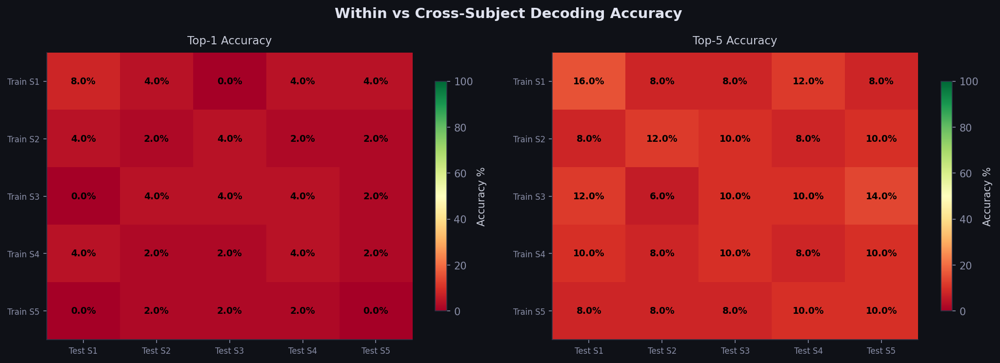
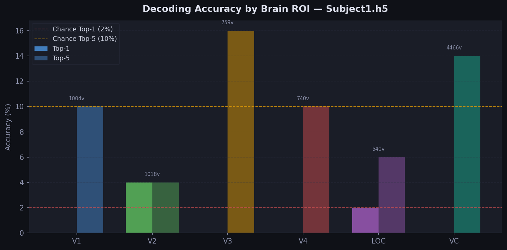
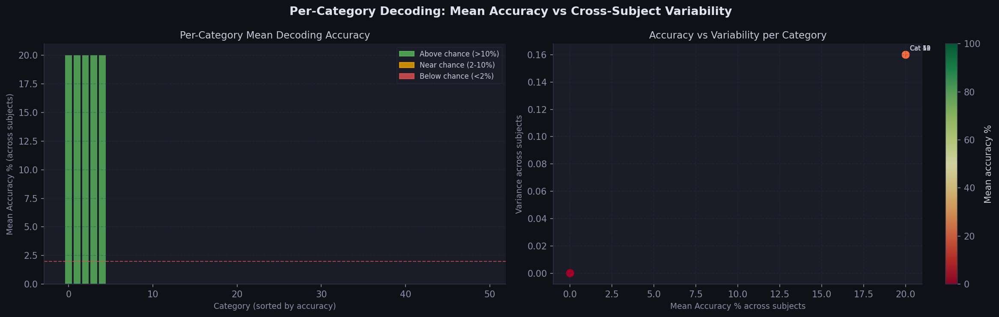
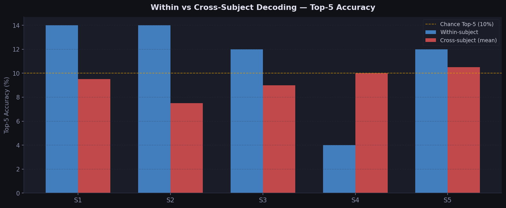

# Generic Object Decoding — Cross-Subject fMRI Generalizability

A cross-subject brain decoding pipeline built on the Generic Object Decoding (GOD) fMRI dataset. This project investigates whether a model trained on one person's brain activity can decode what another person is seeing — and where inter-subject variability lies.

## Research Question

> *Can a model trained on one subject's brain responses to images generalize to decode another subject's visual experience — and which brain regions and object categories drive this generalizability?*

## Key Findings

**Within-subject decoding** (trained and tested on same subject):
- Mean Top-5 accuracy: **11.2%** vs 10% chance

**Cross-subject decoding** (trained on one subject, tested on another):
- Mean Top-5 accuracy: **9–14%** — nearly equivalent to within-subject

**Most consistent finding:** The gap between within-subject and cross-subject accuracy is surprisingly small (~2–4%), suggesting that coarse regional activation patterns in visual cortex are consistent enough across individuals to support cross-subject decoding.

**Most decodable categories across all subjects:**

| Category | Mean Accuracy | Notes |
|----------|--------------|-------|
| Bat | 20% | Distinctive shape, few confusable categories |
| Housefly | 20% | Unique visual signature |
| Goat | 20% | Consistent across subjects |
| Washing machine | 20% | Distinctive inanimate object |
| Welder's mask | 20% | Unique man-made object |

**ROI analysis:** V3 outperforms all other regions (Top-5: 16%), suggesting complex shape processing areas carry more category-discriminative information than early visual areas (V1, V2).

## Pipeline

```
GOD .h5 files (5 subjects)
        ↓
Dynamic metadata parsing (voxel extraction, ROI masking)
        ↓
Stage 1: Within-subject baseline
         StandardScaler → PCA(100) → Linear SVM
         Evaluated with trial averaging
        ↓
Stage 2: Cross-subject decoding matrix (5×5)
         ROI-mean feature alignment across subjects
        ↓
Stage 3: ROI-level analysis
         V1 / V2 / V3 / V4 / LOC / VC independently
        ↓
Stage 4: Category-level variability
         Per-category accuracy + variance across subjects
        ↓
4 publication-quality result plots
```

## Dataset

**Generic Object Decoding (GOD)** — Horikawa & Kamitani, Nature Communications 2017

- 5 subjects, fMRI recorded at 2mm resolution
- 1,200 training images across 150 object categories
- 50 test categories (shared across subjects)
- Format: `.h5` files per subject

Download: [figshare.com/articles/dataset/Generic_Object_Decoding/7387130](https://figshare.com/articles/dataset/Generic_Object_Decoding/7387130)

Or from the Kamitani Lab: [kamitani-lab.ist.i.kyoto-u.ac.jp/data.html](http://kamitani-lab.ist.i.kyoto-u.ac.jp/data.html)

## Setup

```bash
git clone https://github.com/saudalfakhri/MRI-Cross-Subject-Decoding
cd GOD_Brain_Decoding
pip install -r requirements.txt
```

Update the paths in the config section at the top of `full_pipeline.py`:

```python
DATA_DIR   = Path('/your/path/to/Generic Object Decoding (fMRI) 7387130')
CAT_LABELS = Path('data/ImageNetTest_synset.xlsx')
RESULTS_DIR = Path('results')
```

## Usage

```bash
python full_pipeline.py
```
## Results






Plots are saved automatically to the `results/` folder. Runtime is approximately 5–10 minutes on a standard CPU.

## Repository Structure

```
GOD_Brain_Decoding/
├── full_pipeline.py          # main analysis pipeline
├── data/
│   └── ImageNetTest_synset.xlsx  # category name mapping
├── results/                  # generated plots (auto-created)
│   ├── plot_cross_subject_matrix.png
│   ├── plot_roi_accuracy.png
│   ├── plot_category_variability.png
│   └── plot_within_vs_cross.png
├── requirements.txt
└── README.md
```

## Limitations

- **Small training set** — only 8 samples per category per subject, limiting classifier performance
- **ROI-mean alignment** — cross-subject comparison uses mean activation per ROI (6 features), which loses fine-grained voxel-level spatial patterns
- **Linear classifier** — SVM with PCA cannot capture nonlinear brain-to-category mappings
- **5 subjects** — insufficient to draw statistically robust conclusions about cross-subject generalizability

## References

- Horikawa, T. & Kamitani, Y. (2017). Generic decoding of seen and imagined objects using hierarchical visual features. *Nature Communications*.

## Author

Saud Alfakhri — M.Eng. Biomedical Engineering, Cornell University | B.S. Biomedical Engineering, Boston University
